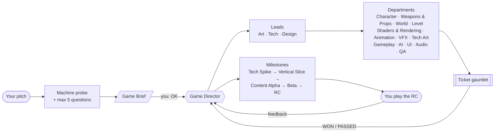
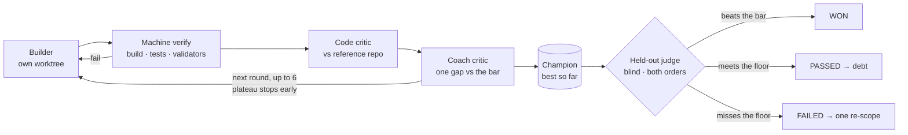
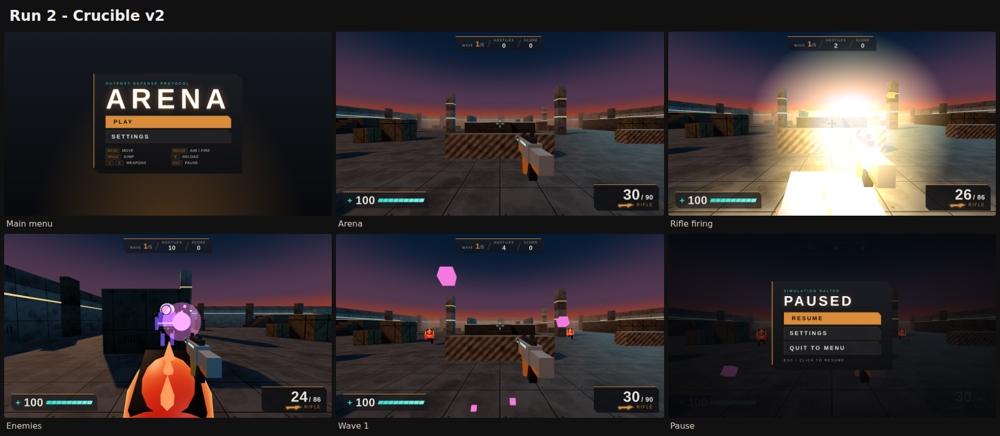
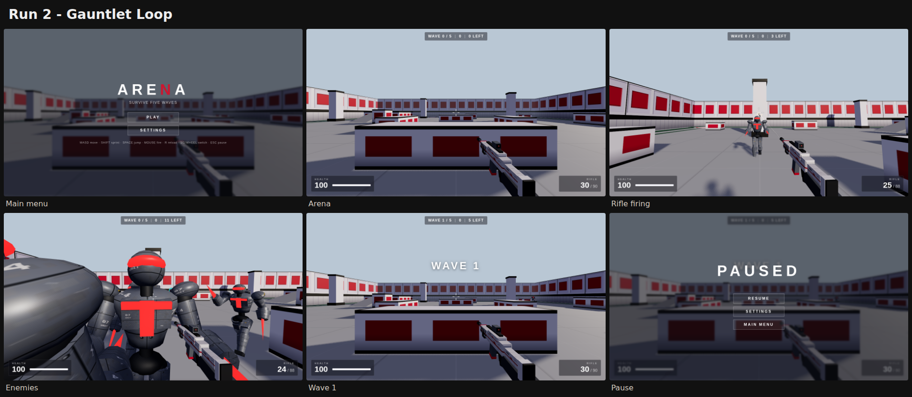
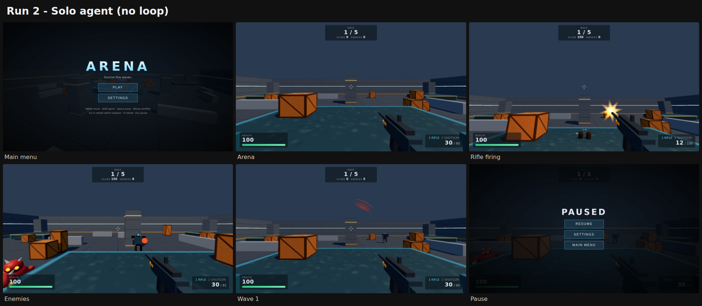
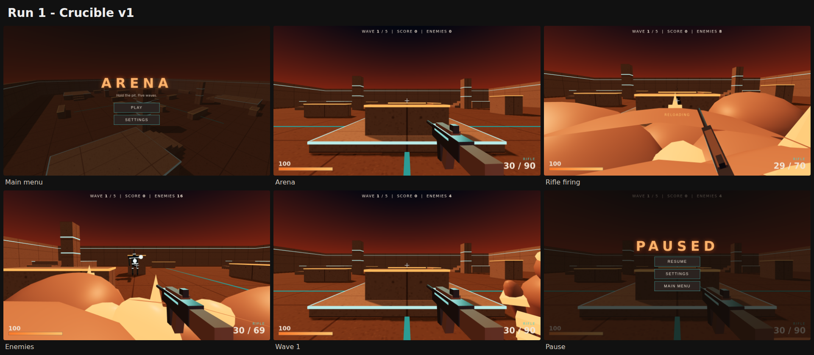
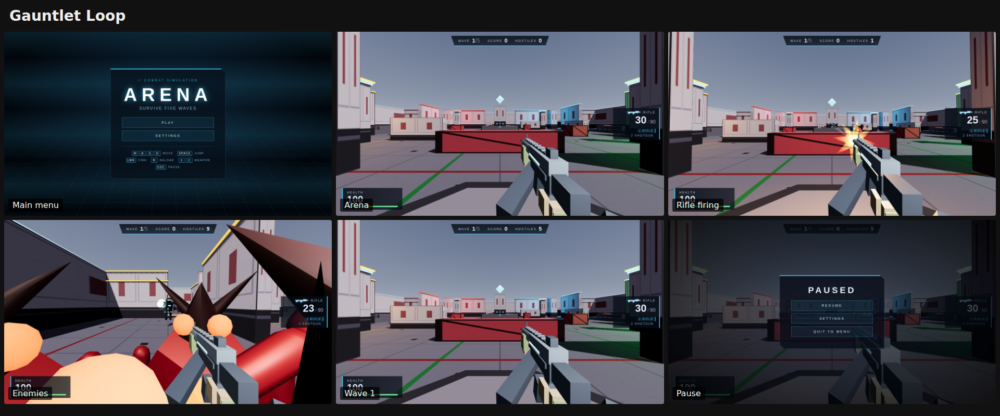
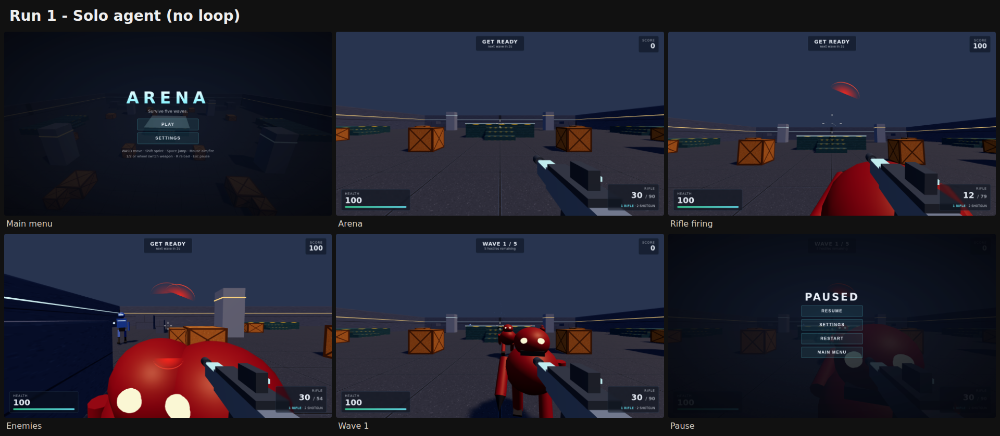

<p align="center">
  
</p>

<p align="center"><sub><a href="assets/crucible-trailer.mp4"><b>▶ Watch the trailer with sound (MP4, 1920×800)</b></a> · score and picture generated entirely in code</sub></p>

<p align="center">
  <b>Describe your game. Approve one page. Crucible runs the studio until there is a game to play.</b>
</p>

<p align="center">
  <a href="#quick-start"></a>
  <a href="#engines-and-tools"></a>
  <a href="#engines-and-tools"></a>
  <a href="LICENSE"></a>
  <a href="https://github.com/mshumer/Claude-of-Duty/blob/main/prompt.md"></a>
</p>

<p align="center">
  <a href="#quick-start">Quick start</a> ·
  <a href="#how-it-works">How it works</a> ·
  <a href="#benchmark">Benchmark</a> ·
  <a href="#under-the-hood">Under the hood</a> ·
  <a href="#limits">Limits</a> ·
  <a href="#credits">Credits</a>
</p>

---

**Crucible** is a Claude Code skill that runs a complete game studio of agents. You pitch a game and approve a one-page brief. From there a **Game Director** agent breaks the game into tickets, sends them to departments (design, code, character art, weapons and props, world and level design, shaders and rendering, animation, VFX, tech art, audio, UI, QA), and drives it from a first tech spike to a release candidate. It does all of that without asking you anything. When the game is done, you play it and say what you think, and Crucible turns your feedback into the next build.

> [!NOTE]
> Crucible is an evolution of the **Gauntlet Loop**, a technique by [Matt Shumer](https://github.com/mshumer) in which a builder and a separate harsh critic loop against a real reference until the work wins. Crucible keeps that core. It adds what building a whole game needs: a studio organisation with leads and departments, budgeted review rounds with a held-out judge, engine adapters, context engineering for multi-day runs, and a human playtest loop. See [Credits](#credits).

## Why Crucible

A single agent asked to build a game stops at "it runs". A single critic loop polishes the pieces but never assembles them into a game. It also forgets everything once the context fills up, and it will loop forever on a piece it cannot beat.

Crucible is built for exactly those failure modes:

| Problem | What Crucible does |
|---|---|
| Nobody holds the whole game together | A **Game Director** owns the brief, the tracker, the milestones and every cut. It never builds anything itself. |
| "Good enough" output | Every ticket faces a **Code critic** and a blind **Experience critic** that compares it with a real shipped game. |
| Too little iteration on what players see, or endless iteration that chases the critic | Hero pieces get **up to 6** review rounds with **plateau stop**, fresh critics and rotating captures; a **held-out judge** decides. Work that falls short becomes debt for later polish passes. |
| Busy process, unchanged game | A **progress contract**: every heartbeat must raise playable quality, reduce a real risk or gain needed information. Progress reviews measure the game and cut process or **replace the approach** when it stops improving. |
| Context loss on long runs, or agents drowning in context | **Files are the memory.** A one-screen `STATUS.md` and a checkbox `TRACKER.md` belong to the Director. Every other agent gets a **context pack built by a tool** - only the sections and interfaces its ticket needs, about 1-6k tokens - and returns at most 5 lines. |
| Games that look like prototypes | Art departments like a real studio - **Character Art, Weapon & Prop Art, World Design, Level Design, Shaders & Rendering**, Animation, VFX - working towards one **hero frame**. A **Visual QA inspector** plays every build and hunts defects up close, in motion and in combat; turntables and filmstrips go to blind critics. Tested starters for modelled assets, a shared material library and a graded post chain. |
| Beautiful but slow | **Performance budgets** from kickoff (draw calls, triangles, shader programs, frame time), measured at every integration; a visual gain that breaks the budget goes back to its owner. |
| The pitch never lists everything a game needs | A **completeness pass** adds what the genre expects: settings, rebinding, hit feedback, checkpoints, juice. |
| Taste the model cannot judge | **You** play the release candidate. Fun, feel and sound are yours to judge, and every piece of feedback becomes a new bar and new tickets. |

## Quick start

**1. Install the skill into your game project**

```bash
git clone https://github.com/Cosmic-Game-studios/gauntlet-loop
cp -r gauntlet-loop/.claude/skills/crucible your-game/.claude/skills/
```

**2. Pitch your game in Claude Code**

```
/crucible A co-op roguelite about lighthouse keepers fighting sea monsters.
          Godot 4, stylised like Sea of Thieves, 20-minute runs.
```

Crucible first checks the machine: GPU or software rendering, installed engines, Blender, capture tools. It then asks at most five questions and shows you a one-page **Game Brief**. Say **OK**, or tell it what to change.

**3. Let it run**

After OK, the Director installs its subagents and hooks into the project and starts working. For long unattended runs, use the bundled driver. It runs every heartbeat as a fresh headless session, so the context never fills up:

```bash
bash tools/drive.sh opus
```

**4. Play it**

At the release candidate, Crucible hands you the build, a `PLAY.md` and a highlight video, then waits. Tell it what you think in your own words, in your own language:

> *"The gunplay doesn't feel good, make it more like CS2. And the art should be more borderless comic style."*

It turns each point into a diagnosis, a new bar and a set of tickets, protects what you liked with regression bars, and comes back with the next build.

## How it works



**The human is needed twice:** once to approve the brief, and once to play and give feedback. In between, the Director decides, logs each decision, and keeps going.

### The ticket gauntlet



- **Two critics, never one.** The Experience critic sees only images and never reads code. The Code critic reads only code and never judges looks. If one critic did both, each concern would excuse the other.
- **Budgeted rounds.** Visible quality needs iteration, so hero pieces get up to six rounds. Endless revision optimises for the critic instead of the player, so every round uses a fresh critic with rotating captures, two rounds without a new champion stop the ticket early, and a fresh judge on held-out captures decides.
- **The best version wins, not the latest.** A revision that made things worse is thrown away.

## Benchmark

> [!IMPORTANT]
> **30-minute time window.** Three contenders build the same game from the same spec, on the same model (Claude Opus 5.5), each as its own headless Claude Code process with 30 minutes. Crucible is designed for runs of hours to days, so this is a deliberately hard setting for it.

**Task:** *Arena*, a 3D first-person arena shooter in the browser (three.js). It has two weapons, two procedurally modelled enemy types with navigation, five waves, a HUD, menus, and synthesised audio. No external assets are allowed. The task is complex enough that a single agent cannot one-shot it well.

**Contenders:** a **solo agent** (one session, no loop, no subagents); the **Gauntlet Loop** (the original prompt: builder and harsh blind critic per piece, looping until it wins); and **Crucible**.

**Evaluation** (all blind unless marked):
- **Independent function harness:** movement, collision, shooting, reload, enemy AI, waves, pause, game over.
- **WebGL performance probe:** draw calls, triangles, frame rate and load time under identical load.
- **Two visual judges:** screenshots.
- **Two code reviewers.**
- **Two playtesters:** they actually play all three games through menus, keys and mouse.
- **Measured cost and tokens.**
- **Log-based assessment:** context, workflow and management. This part is not blind.

### Run 2 - Crucible v2 (studio, model routing, up to 6 rounds, craft rules)

<p align="center"></p>
<p align="center"></p>
<p align="center"></p>

| | Solo agent | Gauntlet Loop | Crucible v2 |
|---|:---:|:---:|:---:|
| **Look & UI** (blind screenshot judges, 1-10) | 4.5 | 5.5 | **6** 🏆 |
| **Look while playing** (blind playtesters) | 5 | 6 | **8** 🏆 |
| **Playability** (blind playtesters) | **6** 🏆 | 5 | 5 |
| Controls · feedback · menus (playtesters) | **7** · 4 · **7.5** | 4.5 · **8** · 3.5 | 4 · 5.5 · 6 |
| **Code quality** (blind reviewers) | 5 | **6.5** | **6.5** |
| Architecture · performance discipline · correctness | 3 · 5 · **6.5** | 6 · 4 · 6 | **7 · 7** · 5.5 |
| **Optimization:** draw calls in combat · triangles · load time | 331 · 23k · 1.1 s | 888 · 81k · 4.5 s | **109 · 8k · 0.8 s** 🏆 |
| Function tests (independent harness) | **15/15** | 14/15 | **15/15** |
| **Context handling**¹ | 5 | 4 | **9** |
| **Workflow**¹ | 5 | 6 | **8** |
| **Management and traceability**¹ | 3 | 5 | **9** |
| Time used of 30 min | 15 min | 22 min | 25 min |
| Cost (list price) | **$2.35** | $9.11 | $8.34 |
| Subagents | 0 | 15 | 20 (13 Opus, 7 Sonnet) |

<sub>¹ Assessed from the run logs by the benchmark author. Not blind.</sub>

**Verdict for run 2.** Crucible v2 made a clear jump from run 1. It now leads on:
- look and UI;
- look while playing;
- optimization: by far the fewest draw calls and triangles, and the fastest load;
- architecture and performance discipline;
- context, workflow and traceability.

It also cost less than the Gauntlet Loop. It ties the Gauntlet Loop on overall code. It loses on playability at low frame rates and on weapon feedback: its muzzle flash plus bloom washes out the centre of the screen. Both weaknesses are now rules in the skill:
- input and fire rate must stay correct at any frame rate, checked in the acceptance suite;
- effects must never cover the target.

The solo agent remains the cheapest and the most robust to play. The Gauntlet Loop has the best hit feedback.

<details>
<summary><b>Run 1 - Crucible v1 (for comparison)</b></summary>

<p align="center"></p>
<p align="center"></p>
<p align="center"></p>

| | Solo agent | Gauntlet Loop | Crucible v1 |
|---|:---:|:---:|:---:|
| Look & UX (blind judges) | 4.5 | **6.5** | 4.5 |
| Code quality (blind reviewers) | 6.5 | 5 | **8** |
| Draw calls idle · combat | 109 · 345 | 270 · 630 | **17 · 296** |
| Context · workflow · management¹ | 5 · 5 · 3 | 4 · 6 · 5 | **9** · 6 · **9** |
| Cost (list price) | **$2.63** | $7.89 | $5.88 |

In run 1 the Gauntlet Loop had the best-looking game and Crucible v1 the best-engineered one, with no clear overall winner. The 14 friction points Crucible logged became v2.
</details>

→ Full reports, raw data, all games and Crucible's `studio/` memory: [run 2](benchmarks/arena-30min/run2/RESULTS.md) · [run 1](benchmarks/arena-30min/run1/RESULTS.md)

## Under the hood

<details>
<summary><b>Game Director and milestones</b></summary>

The Director runs **heartbeats**: load state from files, sense results, judge the milestone gate, plan and cut, dispatch, integrate, report. It decomposes the brief into features and tickets and assigns each ticket a tier (hero, core, bulk). It routes tickets to departments and chains cross-department features. It also runs a completeness pass for everything the genre needs.

Milestones only advance when their gate is met on a real build: **Tech Spike → Vertical Slice → Content Alpha → Beta → Release Candidate → Human Playtest**. Scope is controlled by a mandatory "not this" list, a parking lot for ideas, kill reviews, and a circuit breaker: a wall-clock cap, a budget, or no progress hands off the best build with an honest `KNOWN_GAPS.md`.

→ [`references/director.md`](.claude/skills/crucible/references/director.md)
</details>

<details>
<summary><b>Context engineering</b></summary>

- **Files are the memory, context is a scratchpad.** Anything that matters is written the moment it happens.
- **`STATUS.md` and `TRACKER.md` belong to the Director alone.** They hold a one-screen status and a checkbox list of every ticket and error.
- **Context packs, built by a tool.** The Director writes a short ticket file; `pack.mjs` assembles only the craft, department, style and architecture sections it names, the public interfaces of the modules it calls (never their source) and the lessons tagged for it. Every role has a context budget, and the Director reads the skill by section. This also keeps the critics blind.
- **Return contracts.** Subagents return at most 5 lines. Details go to files, so the Director stays small over hundreds of heartbeats.
- **`LESSONS.md`.** A mistake that repeats becomes a rule for every later builder.
- **Hooks.** `SessionStart` re-injects the state after every compaction, and `PreCompact` snapshots it first.

→ [`references/context.md`](.claude/skills/crucible/references/context.md)
</details>

<details>
<summary><b>Built for Claude Code</b></summary>

| Role | Subagent | Model | Tools |
|---|---|---|---|
| Game Director | main session | Opus | all |
| Art Director (lead) | `art-director` | Opus | all except spawning agents |
| Builder | `studio-builder` | Opus for visual, spatial and feel work; Sonnet for implementation | all except spawning agents |
| Art, UX, coach, judge, coherence | `experience-critic` | Opus | `Read` only (blind pairs in isolated folders; keys behind a deny rule) |
| Code, architecture, audit | `code-critic` | Opus | `Read, Grep, Glob, Bash` (no edits) |
| Visual QA inspector | `visual-qa` | Opus | `Read, Bash` (no edits) - plays the build via `play.mjs` |
| Playtester | `playtester` | Sonnet | `Read, Glob, Bash` (no edits) |

Heartbeat drivers: `tools/drive.sh` (a fresh headless session per heartbeat, for multi-day runs), a scheduled Routine (cloud), or a self-paced `/loop`. The Director verifies that it can really spawn agents before the first ticket. If it can't, it falls back to separate headless sessions and never role-plays the critics itself.

→ [`references/claude-code.md`](.claude/skills/crucible/references/claude-code.md)
</details>

<details>
<summary><b>Engines, adapters and tools</b></summary>

- **One adapter interface per engine:** `probe, build, test, capture, perf, step, package, logs`, proven on the real project in the Tech Spike.
- **Unreal Engine** adapter (`crucible_ue.py`):
  - build: `Build.bat`
  - test: Automation and Functional Tests through `UnrealEditor-Cmd`
  - capture: screenshot functional tests
  - perf: the CSV profiler and Unreal Insights
  - package: `BuildCookRun`
  - multiplayer: dedicated-server smoke tests, and Gauntlet for larger multiplayer suites

  Builders are isolated, merged through an integration queue, and share engine resources through locks. **Web** (three.js) ships ready-made tools: a kickoff script, capture with filmstrips, a step-play tool, a perf probe, acceptance runner, blind pairs, and starters for rendering (`lookdev.js`), the material library (`materials.js`) and modelled assets (`shapes.js`). Godot and Unity follow the same interface.
- **Tools are not prescribed.** Builders use whatever gives the best result, including MCP servers connected to the session, for example an Unreal Editor or Blender MCP server, as well as DCC tools and generators. What is fixed is the engine named in the brief, evidence captured through the adapter, and the model's real limits.
- **Craft built in:** the AAA look layer by layer, world and level design, character and weapon design, shaders, 3D modelling in code, skeletal animation, VFX that never hide the target, comic and cel rendering, optimization budgets and game feel. Measurable craft rules become acceptance checks.

→ [`references/adapters.md`](.claude/skills/crucible/references/adapters.md) · [`references/craft.md`](.claude/skills/crucible/references/craft.md) · [`references/engines.md`](.claude/skills/crucible/references/engines.md)
</details>

<details>
<summary><b>Human playtest loop</b></summary>

At the release candidate the Director stops the driver, hands over the build with `PLAY.md`, and waits. Each piece of feedback gets:

1. **A diagnosis:** the critics measure what is actually wrong.
2. **A new bar:** your reference becomes the bar, for example "like CS2" becomes CS2's recoil and hit feedback, frame-stepped.
3. **Tickets** across the departments involved.
4. **Regression bars** for everything you liked, so a patch that makes anything worse does not ship.

The cycle repeats until you say the game is done.

→ [`references/feedback.md`](.claude/skills/crucible/references/feedback.md)
</details>

<details>
<summary><b>Cost and endurance</b></summary>

- **Ticket tiers.** The full gauntlet goes to what the player notices (about 15%). Bulk assets are judged in batches.
- **Cheap checks first.** No critic is spent on work that fails a script.
- **Model tiering.** Opus judges, Sonnet builds core and bulk, Haiku does clerk work.
- **Calibrated bars.** Narrow questions, matched scope, both orders, degraded control pairs, a bar ladder.
- **Built for week-long runs.** Heartbeats pause and resume on usage limits, every merge is a commit, and progress (not activity) is tracked.

→ [`references/endurance.md`](.claude/skills/crucible/references/endurance.md)
</details>

## Repository layout

```
.claude/skills/crucible/
├── SKILL.md                   intake, bar rules, entry point
├── agents/                    subagents installed into your project's .claude/agents/
│   ├── studio-builder.md      builds one ticket in its own worktree
│   ├── experience-critic.md   coach / judge / coherence, read-only
│   ├── code-critic.md         ticket / architecture / audit, read-only
│   ├── playtester.md          plays via the step-play harness
│   ├── visual-qa.md           plays the build, hunts visual defects with screenshots
│   └── art-director.md        style bible, hero frame, coherence reviews
├── templates/                 CLAUDE.md, hooks, settings.json, drive.sh, pack.mjs (context packs)
│   ├── web/                   kickoff, shot, play, perf, accept/check, blind; lookdev, materials, shapes starters
│   └── unreal/                crucible_ue.py engine adapter
└── references/
    ├── studio.md              org chart, model routing, rituals, dispatch brief
    ├── playbooks.md           how to spend 15 minutes, 30 minutes, hours or weeks
    ├── craft.md               AAA look, world, level, characters, weapons, shaders, animation, VFX, optimization, feel, UI
    ├── adapters.md            engine adapter interface, Unreal, MCP, isolation, locks
    ├── brief-template.md      the one page you approve
    ├── claude-code.md         setup, roles, models, hooks, drivers, model limits
    ├── context.md             files as memory, STATUS/TRACKER, packs, return contracts
    ├── director.md            heartbeat, decomposition, milestones, initiative, scope
    ├── gauntlet.md            up to 6 rounds, plateau stop, critics, champion, held-out judge
    ├── departments.md         what each department builds and how it is judged
    ├── engines.md             headless engines, capture scripts, step-play harness
    ├── endurance.md           tiers, cost, calibrated bars, week-long runs
    ├── state.md               the studio/ folder and its file formats
    └── feedback.md            release candidate handoff and the human playtest loop
```

## Limits

Crucible is honest about what current models cannot do, and it is designed around those limits:

- **Claude cannot generate images, audio or video, cannot hear audio, and cannot watch video.** Art is made with code and tools. Critics judge renders, frame strips and spectrograms. Sound taste is left to your playtest.
- **Whether a game is fun** cannot be judged reliably by an LLM critic. That is what the human playtest is for. You can also comment on the vertical slice preview at any time without stopping the run.
- **The machine sets the ceiling.** Unreal needs a GPU and a local installation; the adapter's `probe` tells the studio what this machine can do. In a GPU-less container, Godot or the web are realistic targets.
- **The target:** a game a player would not recognise as AI-made - a very good indie game, reaching toward AA. The benchmarks above show where Crucible stands today and what it still has to win.

## Credits

Crucible is an evolution of the **Gauntlet Loop**. The technique of a harsh critic, blind comparison against a real bar, and refusing to stop until the work wins is **[Matt Shumer's](https://github.com/mshumer)**. He built [Claude of Duty](https://github.com/mshumer/Claude-of-Duty), wrote the [original prompt](https://github.com/mshumer/Claude-of-Duty/blob/main/prompt.md), and named the loop. The original gauntlet-loop skill that this repository started from was written by Jay E at [RoboNuggets](https://robonuggets.com).

Related reading: [Anthropic on building effective agents](https://www.anthropic.com/engineering/building-effective-agents), which covers the evaluator-optimizer pattern at the heart of the gauntlet.

## License

[CC BY 4.0](LICENSE). Free to use with attribution.
