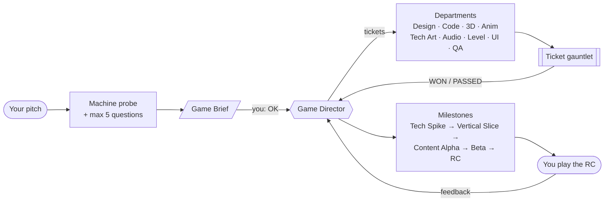
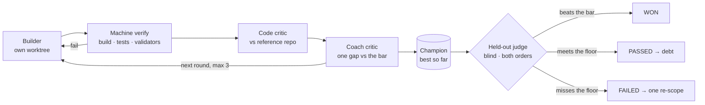

<p align="center">
  
</p>

<p align="center"><sub><a href="assets/crucible-trailer.mp4"><b>▶ Watch the trailer with sound (MP4, 1920×800)</b></a> · score and picture generated entirely in code</sub></p>

<p align="center">
  <b>Describe your game. Approve one page. Crucible runs the studio until there is a game to play.</b>
</p>

<p align="center">
  <a href="#quick-start"></a>
  <a href="#engines-and-tools"></a>
  <a href="#engines-and-tools"></a>
  <a href="LICENSE"></a>
  <a href="https://github.com/mshumer/Claude-of-Duty/blob/main/prompt.md"></a>
</p>

<p align="center">
  <a href="#quick-start">Quick start</a> ·
  <a href="#how-it-works">How it works</a> ·
  <a href="#benchmark">Benchmark</a> ·
  <a href="#under-the-hood">Under the hood</a> ·
  <a href="#limits">Limits</a> ·
  <a href="#credits">Credits</a>
</p>

---

**Crucible** is a Claude Code skill that runs a complete game studio of agents. You pitch a game and approve a one-page brief. From there a **Game Director** agent breaks the game into tickets, sends them to departments (design, code, 3D in Blender, animation, tech art, audio, levels, UI, QA), and drives it from a first tech spike to a release candidate. It does all of that without asking you anything. When the game is done, you play it and say what you think, and Crucible turns your feedback into the next build.

> [!NOTE]
> Crucible is an evolution of the **Gauntlet Loop**, a technique by [Matt Shumer](https://github.com/mshumer) in which a builder and a separate harsh critic loop against a real reference until the work wins. Crucible keeps that core. It adds what building a whole game needs: a management layer, departments, capped rounds with a held-out judge, context engineering for multi-day runs, and a human playtest loop. See [Credits](#credits).

## Why Crucible

A single agent asked to build a game stops at "it runs". A single critic loop polishes the pieces but never assembles them into a game. It also forgets everything once the context fills up, and it will loop forever on a piece it cannot beat.

Crucible is built for exactly those failure modes:

| Problem | What Crucible does |
|---|---|
| Nobody holds the whole game together | A **Game Director** owns the brief, the tracker, the milestones and every cut. It never builds anything itself. |
| "Good enough" output | Every ticket faces a **Code critic** and a blind **Experience critic** that compares it with a real shipped game. |
| Endless revision, optimising for the critic | Rounds are **capped** (hero 3, core 2, bulk 1). A **held-out judge** decides, and the builder never sees it. Work that falls short becomes debt for later polish passes. |
| Context loss on long runs | **Files are the memory.** A one-screen `STATUS.md` and a checkbox `TRACKER.md` belong to the Director. Every other agent gets a small context pack and returns at most 5 lines. |
| The pitch never lists everything a game needs | A **completeness pass** adds what the genre expects: settings, rebinding, hit feedback, checkpoints, juice. |
| Taste the model cannot judge | **You** play the release candidate. Fun, feel and sound are yours to judge, and every piece of feedback becomes a new bar and new tickets. |

## Quick start

**1. Install the skill into your game project**

```bash
git clone https://github.com/Cosmic-Game-studios/gauntlet-loop
cp -r gauntlet-loop/.claude/skills/crucible your-game/.claude/skills/
```

**2. Pitch your game in Claude Code**

```
/crucible A co-op roguelite about lighthouse keepers fighting sea monsters.
          Godot 4, stylised like Sea of Thieves, 20-minute runs.
```

Crucible first checks the machine: GPU or software rendering, installed engines, Blender, capture tools. It then asks at most five questions and shows you a one-page **Game Brief**. Say **OK**, or tell it what to change.

**3. Let it run**

After OK, the Director installs its subagents and hooks into the project and starts working. For long unattended runs, use the bundled driver. It runs every heartbeat as a fresh headless session, so the context never fills up:

```bash
bash tools/drive.sh opus
```

**4. Play it**

At the release candidate, Crucible hands you the build, a `PLAY.md` and a highlight video, then waits. Tell it what you think in your own words, in your own language:

> *"The gunplay doesn't feel good, make it more like CS2. And the art should be more borderless comic style."*

It turns each point into a diagnosis, a new bar and a set of tickets, protects what you liked with regression bars, and comes back with the next build.

## How it works



**The human is needed twice:** once to approve the brief, and once to play and give feedback. In between, the Director decides, logs each decision, and keeps going.

### The ticket gauntlet



- **Two critics, never one.** The Experience critic sees only images and never reads code. The Code critic reads only code and never judges looks. If one critic did both, each concern would excuse the other.
- **Capped rounds.** After two or three rounds, revising mostly optimises for the critic rather than the player. So rounds stop there, a fresh judge on held-out captures decides, and what falls short is picked up later in polish passes with fresh eyes.
- **The best version wins, not the latest.** A revision that made things worse is thrown away.

## Benchmark

> [!IMPORTANT]
> **30-minute time window.** All three contenders build the same game from the same spec, on the same model, and each gets 30 minutes. Crucible is designed for runs of hours to days, so this is a deliberately hard setting for it.

**Task:** *Arena*, a 3D first-person arena shooter in the browser (three.js). It has two weapons, two procedurally modelled enemy types with navigation, five waves, a HUD, menus, and synthesised audio. No external assets are allowed. The task is complex enough that a single agent cannot one-shot it well.

**Contenders:**

| | Method |
|---|---|
| **Solo agent** | One Claude Code session, no loop, no subagents |
| **Gauntlet Loop** | The original gauntlet loop prompt: builder and harsh blind critic per piece, looping until it wins |
| **Crucible** | Game Director, departments, capped two-critic gauntlet, file-based context, one fresh session per heartbeat |

**Evaluation:**
- **Independent automated test harness:** movement, collision, shooting, reloading, enemy AI, waves, pause, game over, frame rate, runtime errors.
- **Blind review by fresh critics:** screenshots and code, with the contender's identity hidden.
- **Workflow, context and management:** measured from the runs.

*Results are being added.*

## Under the hood

<details>
<summary><b>Game Director and milestones</b></summary>

The Director runs **heartbeats**: load state from files, sense results, judge the milestone gate, plan and cut, dispatch, integrate, report. It decomposes the brief into features and tickets and assigns each ticket a tier (hero, core, bulk). It routes tickets to departments and chains cross-department features. It also runs a completeness pass for everything the genre needs.

Milestones only advance when their gate is met on a real build: **Tech Spike → Vertical Slice → Content Alpha → Beta → Release Candidate → Human Playtest**. Scope is controlled by a mandatory "not this" list, a parking lot for ideas, kill reviews, and a circuit breaker: a wall-clock cap, a budget, or no progress hands off the best build with an honest `KNOWN_GAPS.md`.

→ [`references/director.md`](.claude/skills/crucible/references/director.md)
</details>

<details>
<summary><b>Context engineering</b></summary>

- **Files are the memory, context is a scratchpad.** Anything that matters is written the moment it happens.
- **`STATUS.md` and `TRACKER.md` belong to the Director alone.** They hold a one-screen status and a checkbox list of every ticket and error.
- **Context packs.** Every builder and critic gets only the files for its one job, never the project state. This also keeps the critics blind.
- **Return contracts.** Subagents return at most 5 lines. Details go to files, so the Director stays small over hundreds of heartbeats.
- **`LESSONS.md`.** A mistake that repeats becomes a rule for every later builder.
- **Hooks.** `SessionStart` re-injects the state after every compaction, and `PreCompact` snapshots it first.

→ [`references/context.md`](.claude/skills/crucible/references/context.md)
</details>

<details>
<summary><b>Built for Claude Code</b></summary>

| Role | Subagent | Model | Tools |
|---|---|---|---|
| Game Director | main session | Opus | all |
| Builder | `studio-builder` (own git worktree) | Opus for hero, Sonnet for core and bulk | all except spawning agents |
| Coach, judge, coherence | `experience-critic` | Opus | `Read, Glob` (read-only, images) |
| Code, architecture, audit | `code-critic` | Opus | `Read, Grep, Glob, Bash` (no edits) |
| Playtester | `playtester` | Sonnet | `Read, Glob, Bash` (no edits) |

Heartbeat drivers: `tools/drive.sh` (a fresh headless session per heartbeat, for multi-day runs), a scheduled Routine (cloud), or a self-paced `/loop`. The Director verifies that it can really spawn agents before the first ticket. If it can't, it falls back to separate headless sessions and never role-plays the critics itself.

→ [`references/claude-code.md`](.claude/skills/crucible/references/claude-code.md)
</details>

<details>
<summary><b>Engines and tools</b></summary>

Everything runs headless and by script, and every critic judges captured evidence, never a description:

- **Blender** (`blender -b -P`): procedural modelling, validation, turntables, deformation tests for characters, export.
- **Web** (three.js and Playwright), **Godot 4**, **Unity 6** and **Unreal 5**: headless builds, tests, fixed-camera captures, and a step-play harness so agents can play turn by turn.
- **Content without generative models.** Art comes from SVG, procedural textures and Blender renders. Audio comes from synthesis code and MIDI with a soundfont. External generators are used only if the machine has them.
- **Custom hero characters** go through hard gates: topology, 8-pose deformation tests, motion-arc and spacing checks for animation.

→ [`references/engines.md`](.claude/skills/crucible/references/engines.md) · [`references/departments.md`](.claude/skills/crucible/references/departments.md)
</details>

<details>
<summary><b>Human playtest loop</b></summary>

At the release candidate the Director stops the driver, hands over the build with `PLAY.md`, and waits. Each piece of feedback gets:

1. **A diagnosis:** the critics measure what is actually wrong.
2. **A new bar:** your reference becomes the bar, for example "like CS2" becomes CS2's recoil and hit feedback, frame-stepped.
3. **Tickets** across the departments involved.
4. **Regression bars** for everything you liked, so a patch that makes anything worse does not ship.

The cycle repeats until you say the game is done.

→ [`references/feedback.md`](.claude/skills/crucible/references/feedback.md)
</details>

<details>
<summary><b>Cost and endurance</b></summary>

- **Ticket tiers.** The full gauntlet goes to what the player notices (about 15%). Bulk assets are judged in batches.
- **Cheap checks first.** No critic is spent on work that fails a script.
- **Model tiering.** Opus judges, Sonnet builds core and bulk, Haiku does clerk work.
- **Calibrated bars.** Narrow questions, matched scope, both orders, degraded control pairs, a bar ladder.
- **Built for week-long runs.** Heartbeats pause and resume on usage limits, every merge is a commit, and progress (not activity) is tracked.

→ [`references/endurance.md`](.claude/skills/crucible/references/endurance.md)
</details>

## Repository layout

```
.claude/skills/crucible/
├── SKILL.md                   intake, bar rules, entry point
├── agents/                    subagents installed into your project's .claude/agents/
│   ├── studio-builder.md      builds one ticket in its own worktree
│   ├── experience-critic.md   coach / judge / coherence, read-only
│   ├── code-critic.md         ticket / architecture / audit, read-only
│   └── playtester.md          plays via the step-play harness
├── templates/                 CLAUDE.md, hooks, settings.json, drive.sh
└── references/
    ├── brief-template.md      the one page you approve
    ├── claude-code.md         setup, roles, models, hooks, drivers, model limits
    ├── context.md             files as memory, STATUS/TRACKER, packs, return contracts
    ├── director.md            heartbeat, decomposition, milestones, initiative, scope
    ├── gauntlet.md            capped rounds, critics, champion, held-out judge, debt
    ├── departments.md         what each department builds and how it is judged
    ├── engines.md             headless engines, capture scripts, step-play harness
    ├── endurance.md           tiers, cost, calibrated bars, week-long runs
    ├── state.md               the studio/ folder and its file formats
    └── feedback.md            release candidate handoff and the human playtest loop
```

## Limits

Crucible is honest about what current models cannot do, and it is designed around those limits:

- **Claude cannot generate images, audio or video, cannot hear audio, and cannot watch video.** Art is made with code and tools. Critics judge renders, frame strips and spectrograms. Sound taste is left to your playtest.
- **Whether a game is fun** cannot be judged reliably by an LLM critic. That is what the human playtest is for. You can also comment on the vertical slice preview at any time without stopping the run.
- **The machine sets the ceiling.** Unreal needs a GPU. In a GPU-less container, Godot or the web are realistic targets.
- **Realistic target:** a very good indie game, or a strong alpha or beta. AAA is not the goal.

## Credits

Crucible is an evolution of the **Gauntlet Loop**. The technique of a harsh critic, blind comparison against a real bar, and refusing to stop until the work wins is **[Matt Shumer's](https://github.com/mshumer)**. He built [Claude of Duty](https://github.com/mshumer/Claude-of-Duty), wrote the [original prompt](https://github.com/mshumer/Claude-of-Duty/blob/main/prompt.md), and named the loop. The original gauntlet-loop skill that this repository started from was written by Jay E at [RoboNuggets](https://robonuggets.com).

Related reading: [Anthropic on building effective agents](https://www.anthropic.com/engineering/building-effective-agents), which covers the evaluator-optimizer pattern at the heart of the gauntlet.

## License

[CC BY 4.0](LICENSE). Free to use with attribution.
